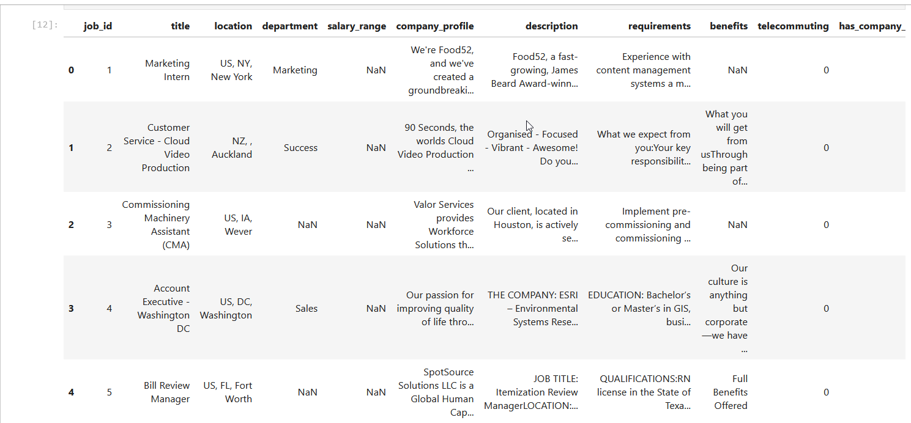

# Spam Job Listing Detection

## Project Overview
This project aims to identify spam job listings using machine learning techniques and natural language processing (NLP). The dataset is processed using libraries like `pandas` and `numpy`, while classification and detection are handled through `scikit-learn`. The project also utilizes `spaCy` for NLP tasks and `matplotlib` for visualizing results.

## Libraries and Tools
The project uses the following key libraries and tools:
- **Python**: Programming language for implementing machine learning models.
- **pandas**: Data manipulation and analysis.
- **numpy**: Numerical computing for handling datasets.
- **matplotlib**: Data visualization and plotting.
- **spaCy**: NLP for text preprocessing.
- **scikit-learn**: Machine learning library for building classification models.

## Getting Started




### Prerequisites
Ensure you have Python installed on your machine. You can install the required libraries by running the following command:

## Installation

1. Clone the repository:
   ```bash
   git clone https://github.com/yourusername/spam-job-detection.git

2. Install required libraries
   ```bash
   pip install -r req.txt


